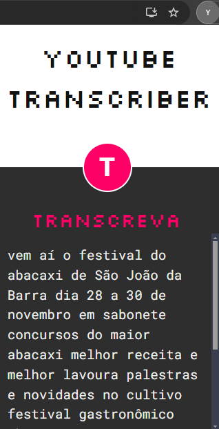
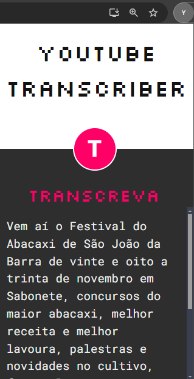

# Audio Transcription
API para transcrever videos do Youtube em PT-BR em um arquivo txt. 

https://github.com/user-attachments/assets/c96c01bf-5b9a-48f0-a3fa-bce573e2015b


## Passo-a-passo
Após fazer o Git Clone, e preparar o ambiente python, execute:
```sh
pip install -r requirements.txt
python app.py
```
caso queira usar o modelo da IA de fala da AssemblyAI, ao invés do app.py execute:
```sh
python appAssemblyIA.py
```

## Atenção
Esse repositório possui dois codigos funcionais, então você pode rodar o comando 'python app.py' que ele vai funcionar normalmente sem requerir mais nada, entretanto se você optar por utilizar o código que utiliza o AssemblyIA será necessario criar uma conta no site da empresa e cadastrar sua API_KEY. 
<br/>
<br/>
A diferença entre os dois é que a qualidade do texto traduzido do AssemblyIA é bastante superior e demora menos tempo para responder a requisição.

## Comparação
<table style="border-collapse: collapse; width: 100%;">
  <tr>
    <td style="text-align: center; border: none;">
      <p><strong>SpeechRecognition</strong></p>
      
    </td>
    <td style="text-align: center; border: none;">
      <p><strong>AssemblyIA</strong></p>
      
    </td>
  </tr>
</table>

## Tecnologias usadas
+ Python
+ Flask
+ SpeechRecognition
+ Pytube
+ moviepy
+ assemblyai

# Audio Transcription
API for transcribing YouTube videos in PT-BR into a text file.

## Step-by-step
After cloning the repository and setting up the Python environment, run:
```sh
pip install -r requirements.txt
python app.py
```
If you want to use AssemblyAI's speech model instead of app.py, run:
```sh
python appAssemblyIA.py
```

## Attention
This repository contains two functional codes, so you can run the command 'python app.py' and it will work normally without requiring anything else. However, if you choose to use the code that utilizes AssemblyAI, you will need to create an account on their website and register your API_KEY.
<br/>
<br/>
The difference between the two is that the transcription quality from AssemblyAI is significantly higher and takes less time to respond to the request.

## Parallel
<table style="border-collapse: collapse; width: 100%;">
  <tr>
    <td style="text-align: center; border: none;">
      <p><strong>SpeechRecognition</strong></p>
      
    </td>
    <td style="text-align: center; border: none;">
      <p><strong>AssemblyIA</strong></p>
      
    </td>
  </tr>
</table>

## Technologies used
+ Python
+ Flask
+ SpeechRecognition
+ Pytube
+ moviepy
+ assemblyai
